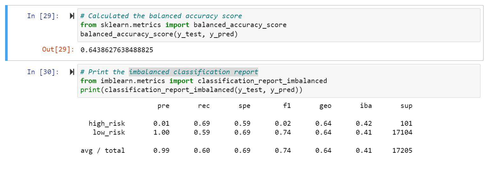
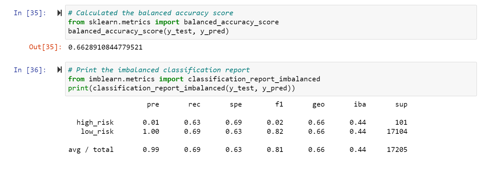
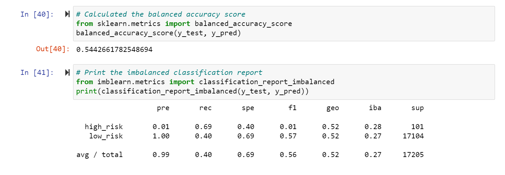
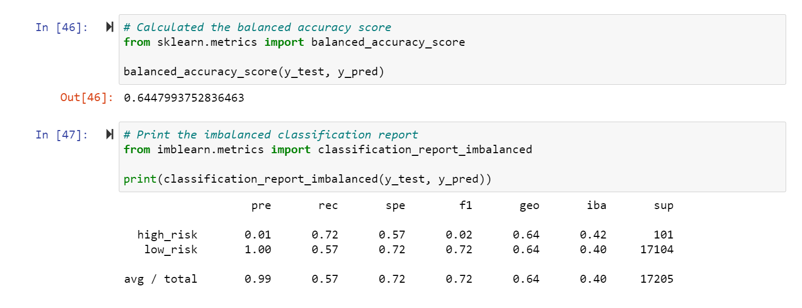
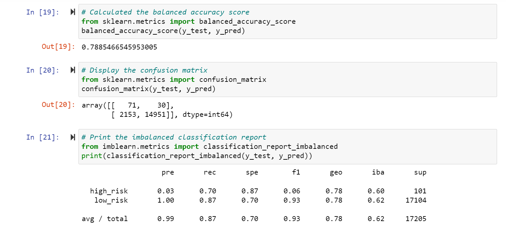
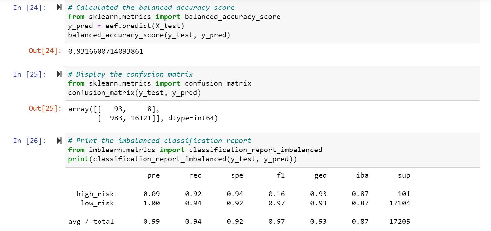
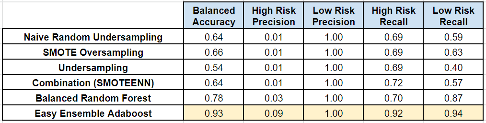

# Credit_Risk_Analysis

## Purpose
In this analysis, use a credit card dataset from Lending Club, a peer-to-peer lending service we will evaluate different methods of mitigating the challenges of an inbalanced classification problem. When predicting credit risk, good loans will always outnumber bad loans in your dataset, which can severely bias the classifier. I will test oversampling, undersampling, and combinatorial approaches, as well as new bias reducing models. I will evaluate their performance and make a recommendation on whether to use them to predict credit risk.

## Results
- Naive Random Oversampling
    - This method balances the training dataset by randomly duplicating examples in the minority class (high risk)
    - This method resulted in a balanced accuracy score of 0.64, which means it is moderately good at being able to correctly classify high risk loans. 
    - This method resulted in a precision of only 0.01  for high risk loans, and 1.00 for low-risk loans. This means that out of all the loans that the model predicted to be high risk, only 1% were actually high risk. 
    - Recall was 0.69 for high risk and 0.59 for low risk. This means the model is correctly identifying about 69% of the true high risk loans, and about 59% of the true low risk loans. 

    

- SMOTE Oversampling
    - This method balances the training dataset by generating synthetic samples for the minority class (high risk).
    - This method resulted in a balanced accuracy score of 0.66, which means it is moderately good at being able to correctly classify high risk loans, and slightly better than naive random oversampling
    - This method resulted in a precision of only 0.01  for high risk loans, and 1.00 for low-risk loans. This means that out of all the loans that the model predicted to be high risk, only 1% were actually high risk. 
    - Recall was 0.63 for high risk and 0.69 for low risk. This means the model is correctly identifying about 63% of the true high risk loans, and about 69% of the true low risk loans.

    

- Undersampling 
    - This method balances the training dataset by reducing the number of the majority class by raplacing clusters of majority samples with the cluster centroid (KMeans algorithm).
    - This method resulted in a balanced accuracy score of 0.54, which means it is average at being able to correctly classify high risk loans, and performs worse than the oversampling methods above. 
    - This method resulted in a precision of only 0.01  for high risk loans, and 1.00 for low-risk loans. This means that out of all the loans that the model predicted to be high risk, only 1% were actually high risk. 
    - Recall was 0.69 for high risk and 0.40 for low risk. This means the model is correctly identifying about 69% of the true high risk loans, and about 40% of the true low risk loans. 

    

- Combination (SMOTEENN)
    - This method balances the training dataset by generating synthetic samples for the minority class, but then editing those samples by dropping data points where its closest neighbors belong to two different classes. 
    - This method resulted in a balanced accuracy score of 0.64, which means it is moderately good at being able to correctly classify high risk loans, and performs about as well as oversampling methods. 
    - This method resulted in a precision of only 0.01  for high risk loans, and 1.00 for low-risk loans. This means that out of all the loans that the model predicted to be high risk, only 1% were actually high risk. 
    - Recall was 0.72 for high risk and 0.57 for low risk. This means the model is correctly identifying about 72% of the true high risk loans, and about 57% of the true low risk loans.

    

- Balanced Random Forest
    - This method randomly under-samples each bootstrap sample to reduce bias. 
    - This method resulted in a balanced accuracy score of 0.78, which means it is good at being able to correctly classify high risk loans, and performs about better than any of the under or oversampling methods. 
    - This method resulted in a precision of 0.03 for high risk loans, and 1.00 for low-risk loans. This means that out of all the loans that the model predicted to be high risk, about 3% were actually high risk. 
    - Recall was 0.70 for high risk and 0.87 for low risk. This means the model is correctly identifying about 70% of the true high risk loans, and about 87% of the true low risk loans. 

    

- Easy Ensemble AdaBoost
    - This method is a meta-estimator that sequentially adds decision trees that focus on the more difficult cases, learning from the mistakes of previous trees.
    - This method resulted in a balanced accuracy score of 0.93, which means it is very good at being able to correctly classify high risk loans, and performs better than any other method. 
    - This method resulted in a precision of 0.09 for high risk loans, and 1.00 for low-risk loans. This means that out of all the loans that the model predicted to be high risk, about 9% were actually high risk. 
    - Recall was 0.92 for high risk and 0.94 for low risk. This means the model is correctly identifying about 92% of the true high risk loans, and about 94% of the true low risk loans. 
    
    

## Summary

See a summary of the discussed metrics below:

The various over and undersampling methods moderately improved the relevant recall scores, reducing the bias of of the imbalanced dataset. Each had trade-offs, some increasing recall more for high-risk, and some for low-risk. The two ensemble learning methods were particularly successful, with AdaBoost increasing recall for both labels above 90%.

To predict credit risk, I would recommend using the AdaBoost model. This model has high recall for high risk loans, correctly identifying about 92% of the true high risk loans. It is able to successfully identify high risk loans without mislabeling them as low risk. This is the most important metric for this application, where the company wants to reduce the number of high risk loans it approves. It has similarly high recall for low-risk loans at 94%, meaning relatively few true low-risk loans are mislabeled. 

This results in a good balance between the liability of lending to clients that will end up defaulting, and the lost profit from refusing loans to clients who would have paid the loan back.

It should be noted, however, that about 90% of the loans this model labeled as high risk were actually low risk loans (low precision). This is substantially better than the other models, but still quite low. Many loans to qualified clients will be denied. 

